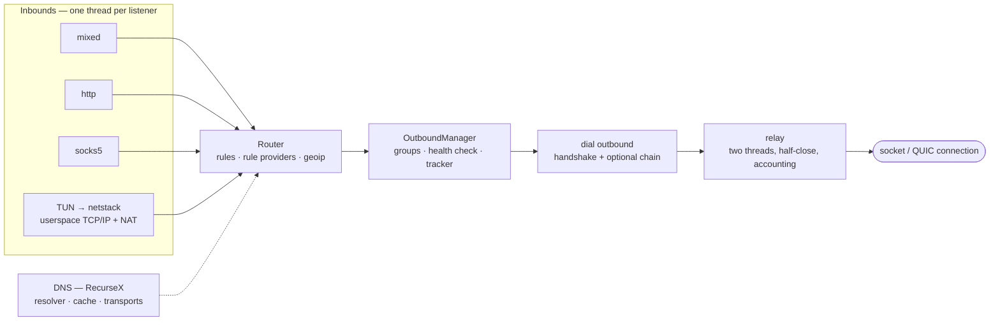
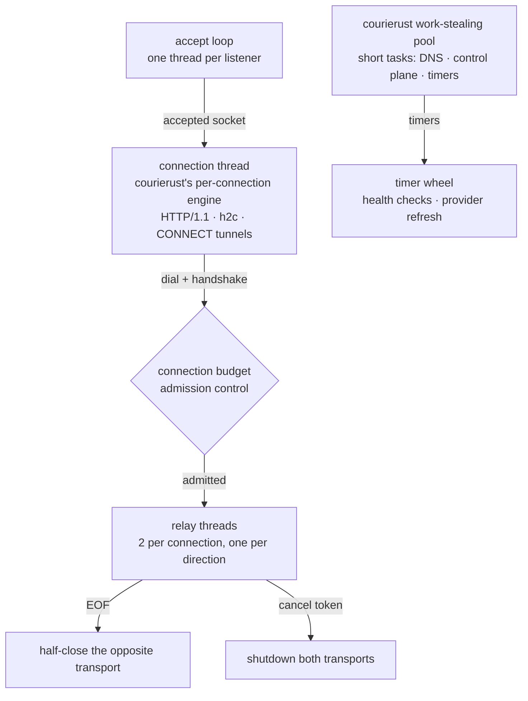
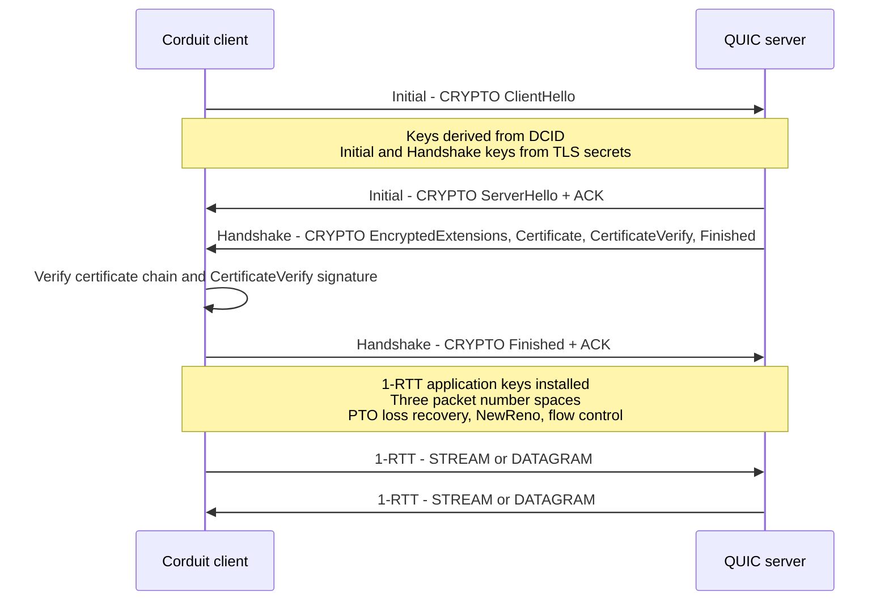

# Corduit

A synchronous network proxy engine for Rust, with a `no_std` core. The
configuration model, rule router, DNS stack, userspace TCP/IP stack and every
wire protocol live in one crate, built without a third-party proxy core;
**there is no async runtime anywhere in the dependency tree**.

[](https://crates.io/crates/corduit)
[](https://docs.rs/corduit)
[](Cargo.toml)

- **中文说明** → [README.zh-CN.md](README.zh-CN.md)
- **完整文档** → [Wiki](https://github.com/blueokanna/Corduit/wiki)（FFI / RPC / 方法参考）

---

## Legal notice — read before building or running anything

Corduit is a network engineering toolkit: proxy protocols, a rule router, DNS
and a userspace TCP/IP stack. It is published for **lawful use only**.

- **Your local law governs.** Nothing in this repository, its license or its
  documentation grants any permission the law applying to you does not already
  give you. You alone are responsible for how you use it.
- **Do not use it to break the law.** In some jurisdictions, mainland China
  included, providing or using a proxy, VPN or tunnel service to bypass state
  network controls is illegal. Corduit grants no right to do that, and the
  maintainers neither authorize nor support it.
- **TUIC, Hysteria and Hysteria2 are opt-in.** They are disabled Cargo features
  (`tuic`, `hysteria`, `hysteria2`) and are absent from a default build;
  enabling them is your own decision.
- **Unlawful use gets no support.** Issues, pull requests and discussions that
  would enable unlawful use will be closed.
- **No warranty, no liability.** The software is provided as is. See
  [LICENSE](LICENSE), whose additional licensor terms make lawful use a
  condition of every license granted.
- **This is not legal advice.** If you are unsure whether your intended use is
  lawful, consult a qualified lawyer in your jurisdiction before building or
  running anything.

---

## What it is

Most proxies are assemblies: a config loader, a rule engine, a DNS resolver
and a set of protocol kernels, each from a different upstream with its own bug
tracker and release cadence. Corduit keeps those parts in one engine, where
configuration, routing, DNS, userspace networking and the wire protocols are
developed, tested and released together.

Capabilities:

- **Inbounds**: `http`, `socks5` and `mixed` (HTTP + SOCKS5 auto-detection) as
  configured listeners; TUN mode over the in-tree userspace stack, driven
  through the platform entry points rather than the `inbounds` list. `redir`
  and `tproxy` parse as types but have no listener: a build logs a warning and
  starts nothing for them.
- **Outbounds**: `direct`, `reject`, `socks5`, `socks4` / `socks4a`, `http`
  (plain or TLS-wrapped), `shadowsocks`, `shadowsocksr`, `snell` (v4 / v5),
  `vmess`, `vless`, `trojan`, `wireguard`, `naive` (NaiveProxy), the opt-in
  `shadowtls` (v3), `tuic` (v5), `hysteria` (v1) and `hysteria2`; plus the
  group selectors `selector`, `url-test`, `fallback`, `load-balance` and
  `relay`.
- **Routing**: `domain`, `domain-suffix`, `domain-keyword`, `domain-regex`,
  `geoip`, `ip-cidr`, `src-ip-cidr`, `src-port`, `dst-port`, `process-name`,
  `rule-set` and `match`, with `rule` / `global` / `direct` modes; rule
  providers and proxy providers refresh on an interval.
- **DNS**: the resolver is [RecurseX](https://crates.io/crates/recurse-x), the
  same author's library, consumed as a dependency. It provides upstreams over
  UDP / TCP / DoT / DoH / DoH3 / DoQ, a stability-measured multi-tier cache,
  request coalescing and server selection priced by expected cost. Corduit
  supplies the parts that come from the profile dialect
  (`nameserver-policy`, `default-nameserver`, `hosts`, `cache-size`), the
  hostname-to-literal bootstrap for encrypted upstreams, and the bogon / GeoIP
  answer filter, since RecurseX ships no country database. With `dns.enable`
  set, a real listener answers on `dns.listen` over both UDP and TCP, from the
  same profile.
- **Synchronous execution**: no tokio, no reactor, no `async` / `await` in the
  engine. Concurrency comes from a work-stealing pool for short tasks and
  dedicated threads for long-lived relays.
- **`no_std` core**: with `default-features = false` the crate compiles on
  `no_std + alloc`. The crypto primitives, the URL parser and the pure wire
  codecs (`protocol::address`, `protocol::error`) carry no OS dependency.
- **Hot reload** (`Corduit::reload`) and **traffic accounting**
  (per-connection up/down, speed, active list).

## Architecture



A connection enters one inbound listener, is classified by the router, and is
handed to one outbound. The relay owns it until either side closes, and every
byte it copies is counted per connection.

## The synchronous execution model

Corduit has no reactor. Concurrency is layered, and each layer does one job:



1. **Short tasks** (DNS lookups, control plane, periodic refresh, timer
   callbacks) run on **courierust's work-stealing thread pool**: per-worker
   LIFO caches, a global FIFO, cross-worker stealing, zero CPU when idle.
2. **Long-lived relays** run on **dedicated threads**, two per connection, one
   per direction, with half-close semantics. Their number is bounded by a
   `SessionGate`, so relays cannot starve the pool of handshake capacity.
3. **Accept loops** run one thread per listener. Each accepted socket is served
   on a thread of its own by **courierust's per-connection engine** (TLS/ALPN,
   HTTP/1.1, HTTP/2, keep-alive, `CONNECT` tunnels, WebSocket upgrades), and
   the listener's connection budget blocks the accept loop once the limit is
   reached, so idle clients cannot grow threads without bound.

Blocking is bounded by socket timeouts (`SO_RCVTIMEO` / `SO_SNDTIMEO`):
`WouldBlock` and `TimedOut` mean *nothing happened yet*, and each loop
re-checks its `CancellationToken` between operations. The two relay threads
share a stream behind a mutex, so a read that could block indefinitely would
be a lock-ordering deadlock. The relay therefore sets a 25 ms read poll
(`RELAY_READ_POLL`) before it starts, which bounds every lock hold.

The cost is explicit: connections that stay open but mostly idle occupy one
thread each. The session gate caps that cost, and the pool keeps short work
fast. For a desktop or mobile proxy with tens to a few hundred concurrent
connections, the trade is reasonable.

## Cargo features

| Feature | Default | What it adds |
|---|---|---|
| `std` | on | Threaded engine layer: engine, netstack, RPC, FFI. Implies `tls`. |
| `tls` | on | `protocol::tls` client/server layers and the TLS-based outbounds (HTTPS, Trojan, VMess/VLESS TLS, TLS inbounds). |
| `wireguard` | on | `protocol::wireguard` plus the WireGuard outbound. |
| `quic` | off | `protocol::quic` — the in-tree QUIC v1 client transport (RFC 9000/9001/9002). |
| `tuic` | off | TUIC v5 outbound. Implies `quic`. |
| `hysteria` | off | Hysteria v1 outbound (control-stream auth, XPlus obfuscation, struct-encoded UDP datagrams). Implies `quic`. |
| `hysteria2` | off | Hysteria2 outbound (HTTP/3 `POST /auth`, Salamander obfuscation). Implies `quic`. |
| `tls13` | off | The in-tree TLS 1.3 client and the browser-shaped `ClientHello` fingerprints it can present (`chrome`, `randomized`, `off`). |
| `reality` | off | REALITY client authentication for VLESS/Trojan/VMess (`security: reality`). Implies `tls13`. |
| `shadowtls` | off | ShadowTLS v3 outbound. Implies `tls13`. |

A build that lacks `tuic`, `hysteria`, `hysteria2` or `shadowtls` **rejects**
the matching outbound with a config error naming the missing feature; it never
falls back to a direct connection. The same rule applies to `security: reality`
and to `fingerprint` when `tls13` is off.

## Division of labour: courierust vs. in-tree

[courierust](https://crates.io/crates/courierust) is a zero-dependency,
`no_std`-capable protocol suite. Corduit consumes it as a library and builds
only the layers courierust deliberately does not expose:

| Concern | Implementation |
|---|---|
| HTTP/1.1 codec, HTTP/2 connection, HTTP/3 framing | `courierust_h1` / `courierust_h2` / `courierust_h3` |
| QPACK field sections (HTTP/3 headers) | `courierust_h3::qpack` |
| HTTP client (pools, redirects, TLS settings) | `courierust_client` |
| TLS 1.2 / 1.3, X.509 validation, crypto primitives | `courierust_tls` |
| WebSocket RFC 6455 (framing, masking, fragmentation, close) | `courierust_ws`, wrapped once by `protocol::ws` |
| QUIC wire codecs (packets, frames, varint, packet protection) | `courierust_quic` |
| Work-stealing scheduler | `courierust_pool` |
| base64 | `courierust_crypto::base64` |
| QUIC v1 **connection runtime** (handshake driver, ACK/loss recovery, congestion control, flow control, datagrams) | `protocol::quic` (in-tree) |
| TLS 1.3 client with data-driven `ClientHello` fingerprints | `protocol::tls13` (in-tree) |
| REALITY client (`security: reality`) | `protocol::reality` (in-tree) |
| Shadowsocks / ShadowsocksR / Snell / VMess / VLESS / Trojan / ShadowTLS / NaiveProxy / TUIC / Hysteria / Hysteria2 / WireGuard / SOCKS4 | `engine::outbound` (in-tree) |
| DNS resolver, semantic cache, UDP/TCP/DoT/DoH/DoH3/DoQ transports, wire codec | [RecurseX](https://crates.io/crates/recurse-x) — the same author's resolver, consumed as a library |
| Profile → resolver adaptation, upstream bootstrap, bogon/GeoIP answer filter | `dns` (in-tree) |
| Userspace TCP/IP stack (SolidTCP) + NAT + TUN | `netstack` (in-tree) |
| Dual-stack (IPv4 + IPv6) netstack data path: v6 packet parsing and reply construction (TCP/UDP, v6 pseudo-header checksums), v6 SOCKS5 targets and v6 UDP relay replies | `netstack` (in-tree) |

The workspace follows one rule: one implementation per responsibility. A
second RFC 6455 state machine, a second QPACK codec, a second base64 or a
second DNS wire codec is treated as a defect, not a feature.

## REALITY and TLS fingerprints

The optional `tls13` and `reality` features add a second TLS engine beside
courierust's connector. Its `ClientHello` is data-driven, and server
authentication runs through a hook:

- **Fingerprints** (`fingerprint: chrome | randomized | off`): the cipher-suite
  list, extension set and order, groups, signature algorithms, ALPN and padding
  come from `courierust_fingerprint`'s Chrome profile, the parameter set of the
  JA4 specification, with GREASE and 512-byte padding as a browser sends them.
  Tests parse the emitted bytes back and compare JA3/JA4.
- **REALITY** (`security: reality` with `public-key`, `short-id`,
  `server-name`): the session id carries `version || time || short-id` sealed
  with AES-256-GCM under the X25519-derived auth key, and the server is
  authenticated by the ephemeral-certificate proof (`HMAC-SHA512` over the
  certificate SPKI in place of a CA chain).
- **Not advertised instead of faked**: certificate compression (RFC 8879) and
  ALPS are not advertised, since the client cannot decompress or present them;
  `mldsa65` verification is rejected as unsupported; and a REALITY *fallback*
  (a real certificate arrives) is a hard error, not a silent downgrade.
- **Client side only**: a REALITY *server* needs an Ed25519 signer for
  `CertificateVerify`, which the in-tree crypto layer does not provide. The
  session-id verification half is implemented and tested
  (`protocol::reality::wire::unseal_session_id`).

## The QUIC stack

courierust ships the RFC 9000/9001 wire codecs and the TLS 1.3 crypto, but no
QUIC connection runtime, and its `courierust_tls::quic` handshake driver is
crate-private. Corduit therefore implements the missing layer in
`protocol::quic`: one driver thread per connection owns the UDP socket, the
handshake runs the TLS 1.3 key schedule itself, and streams are synchronous
`Read` / `Write` handles over mutex-guarded buffers with condvar wakeups.



On top of that transport sit TUIC v5 (`tuic`), Hysteria v1 (`hysteria`) and
Hysteria2 (`hysteria2`): three protocols that share nothing above QUIC.
Hysteria2 is implemented against the official specification: HTTP/3 `POST /auth`
on a client-initiated bidirectional stream (QPACK field section, `:status 233`
expected), `0x401` TCP request frames, its own UDP session / fragment framing,
and Salamander packet obfuscation (BLAKE2b-256 keyed by an 8-byte per-packet
salt, applied at the socket layer). Hysteria v1 is the older design: a struct
(no alignment padding, big-endian) `client hello` on a control stream, one
bi-stream per TCP connection, struct-encoded UDP datagrams, and its own XPlus
obfuscation (SHA-256 keyed by a 16-byte salt). XPlus serves the same purpose as
Salamander but does not interoperate with it, which is why the two use separate
types.

Four things are intentionally absent, and a config that asks for one gets an
explicit warning instead of a silent substitution: 0-RTT (early data), BBR /
TCP-Brutal congestion control (NewReno is the only controller), source-port
hopping, and TLS fingerprint mimicry on the courierust connector.

## Driving the engine

Every frontend ends up in the same typed dispatch table (`rpc::dispatch`):

| Frontend | Transport | Reference |
|---|---|---|
| Flutter / Kotlin / Swift / C++ | hand-written C ABI (`corduit_call`, `corduit_call_binary`) | [FFI-API](https://github.com/blueokanna/Corduit/wiki/FFI-API) |
| Browser dashboard / any language | localhost HTTP + WebSocket JSON-RPC | [RPC-API](https://github.com/blueokanna/Corduit/wiki/RPC-API) |
| Rust application | typed synchronous `api::*` | [Rust-API](https://github.com/blueokanna/Corduit/wiki/Rust-API) |

The RPC server binds loopback only and requires a bearer token compared in
constant time; the WebSocket path takes the token as a `?token=` query
parameter, since browsers cannot set headers on a WebSocket handshake. Upgrades
are answered by the same `courierust_ws` session the VMess transport uses, in
the server role.

## Quick start

Build a `Config`, construct the engine, start it, stop it. There is no runtime
to initialize.

```toml
[dependencies]
corduit = "0.2"
```

```rust,no_run
use corduit::engine::{
    Config, Corduit, GeneralConfig, InboundConfig, InboundType,
    OutboundConfig, OutboundType,
};

fn main() -> corduit::engine::Result<()> {
    let config = Config {
        general: GeneralConfig { mixed_port: Some(7890), ..Default::default() },
        inbounds: vec![InboundConfig {
            inbound_type: InboundType::Mixed,
            tag: "mixed-in".to_string(),
            listen: "127.0.0.1".to_string(),
            port: 7890,
            options: Default::default(),
        }],
        outbounds: vec![OutboundConfig {
            outbound_type: OutboundType::Direct,
            tag: "DIRECT".to_string(),
            server: None,
            port: None,
            options: Default::default(),
        }],
        ..Config::default()
    };

    let engine = Corduit::new(config)?;
    engine.start()?;
    // ... serve ...
    engine.stop()
}
```

Or use the JSON facade, which is what the FFI and RPC layers call:

```rust,no_run
use corduit::api;

fn main() -> Result<(), Box<dyn std::error::Error>> {
    api::start_proxy_from_yaml(r#"
    {
      "general": { "mode": "rule", "mixed_port": 7890, "log_level": "info" },
      "dns": { "enable": true, "nameservers": ["https://dns.google/dns-query"] },
      "inbounds": [{ "type": "mixed", "tag": "mixed-in", "listen": "127.0.0.1", "port": 7890 }],
      "outbounds": [{ "type": "direct", "tag": "DIRECT" }],
      "rules": []
    }"#.to_string())?;

    let status = api::get_corduit_status()?;
    println!("running = {}", status.running);
    api::stop_proxy()?;
    Ok(())
}
```

Expose it to a dashboard in two lines:

```rust,no_run
use corduit::api;
api::start_rpc_server(8765, Some("my-token".into()))?; // 127.0.0.1 only
```

```bash
curl -X POST http://127.0.0.1:8765/rpc \
  -H "Authorization: Bearer my-token" \
  -H "Content-Type: application/json" \
  -d '{"method":"get_version"}'
# {"code":0,"data":"Corduit v0.2.2"}
```

## Configuration

One validated JSON model: `general` / `dns` / `inbounds` / `outbounds` /
`rules`. Every enum is a string, and an invalid value is rejected at the
boundary before the engine touches it. Field-by-field reference:
[Configuration](https://github.com/blueokanna/Corduit/wiki/Configuration).

## Project layout

```
src/
├── lib.rs          # module wiring, globals, no_std gating, platform entry points
├── api.rs          # typed synchronous API
├── ffi.rs          # hand-written C ABI
├── rpc/            # shared dispatch + localhost HTTP/WebSocket JSON-RPC
├── types.rs        # shared DTOs
├── common/         # pool overlay, sockets, relay, listener, timers,
│                   #   cancellation, URL, courierust HTTP client, root certificates
├── engine/         # config, routing, inbounds, outbounds, providers, stats
├── crypto/         # crypto primitives + text codecs (no_std)
├── protocol/       # wire protocols: QUIC v1, TLS 1.3, REALITY, WebSocket, WireGuard
├── dns/            # profile → RecurseX adaptation: upstreams, bogon, patterns
└── netstack/       # userspace TCP/IP (SolidTCP), TUN, NAT, VPN drivers
```

The `no_std` core is `crypto/`, `common/url`, `protocol/address` and
`protocol/error`, which are pure logic with no OS dependency. The threaded
networking layer (engine, netstack, RPC, transports) is gated behind the `std`
feature.

## Building and testing

```bash
cargo check --all-targets
cargo test                            # unit + property tests, default features
cargo test --features tuic,hysteria2  # include the optional QUIC-based outbounds
cargo test --doc
cargo clippy --all-targets --all-features -- -D warnings
cargo fmt --all -- --check
cargo check --no-default-features                 # the no_std protocol core
cargo check --no-default-features --features std  # engine layer, no optional protocols
cargo test --no-default-features --features std   # …and its test code
cargo run --example minimal                       # a real engine, loopback only
```

CI runs the full check-and-test matrix on Linux, macOS and Windows, an
`--all-features` job (which builds and tests the gated QUIC / TUIC / Hysteria
code), a `no_std` core check, a `std`-only configuration that is both checked
and tested, Android (aarch64 and x86_64) and iOS cross-checks, and an MSRV job
that builds and tests on 1.78. The desktop jobs also run the loopback-only
examples, which drive the crate as an application, and build the docs with
`--all-features`. `RUSTFLAGS` and `RUSTDOCFLAGS` are both `-D warnings`, so a
warning and a broken intra-doc link both fail the build.

MSRV: **Rust 1.78**. No HTTP/TLS/QUIC third-party library and no async runtime:
the network layer is courierust plus the in-tree codecs above, and concurrency
is courierust's work-stealing pool plus `std::thread`.

## Security boundary

This is a local tool that controls network traffic, so the boundary is explicit:

- **FFI**: no panic ever unwinds across `extern "C"`; every argument is
  type-checked; the binary channel is bounded (`rustbinary`, 64 MiB cap).
- **RPC server**: loopback bind only, constant-time bearer-token comparison,
  16 MiB request cap, idle connections reaped, WebSocket upgrades validated
  against RFC 6455 (`Sec-WebSocket-Key` shape and accept value).
- **Outbound handshakes**: a WebSocket upgrade whose `Sec-WebSocket-Accept`
  does not match is a hard failure, not a warning; config-supplied handshake
  headers (token name, no CR/LF) are validated before a byte reaches the wire.
- **Data paths**: DNS wire parsing is RecurseX's, which caps section counts
  before any loop, bounds every length field against the message, and follows
  compression pointers only forwards with a hop budget derived from the 255-byte
  name limit; MMDB reads bounds-checked, HTTP response bodies capped,
  `skip-cert-verify` off by default.

More: [Security](https://github.com/blueokanna/Corduit/wiki/Security).

## License

[PolyForm Strict License 1.0.0](LICENSE), plus additional licensor terms.

- **Permitted**: personal use (research, experiment, testing, personal study,
  hobby projects) and noncommercial purposes, including use by noncommercial
  organizations.
- **Not permitted**: distributing the software in any form (free or paid) and
  making changes or new works based on it.
- **Conditioned on lawful use**: no circumvention rights are granted, and use
  must stay inside the law that applies to you.

Required Notice: Copyright 2026 blueokanna (https://github.com/blueokanna/Corduit)
