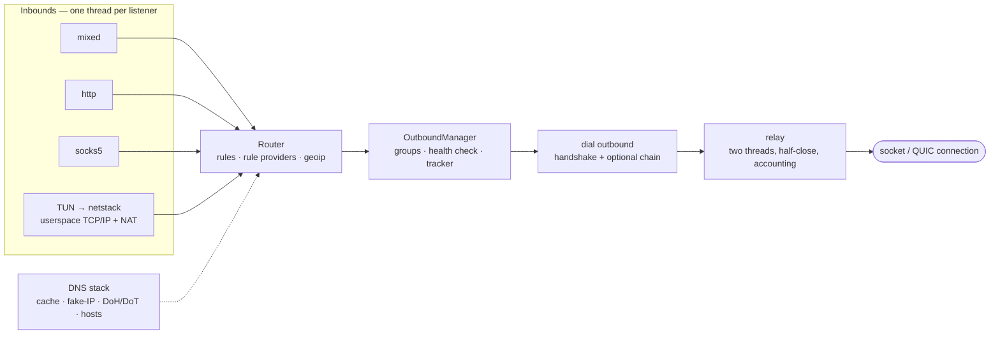
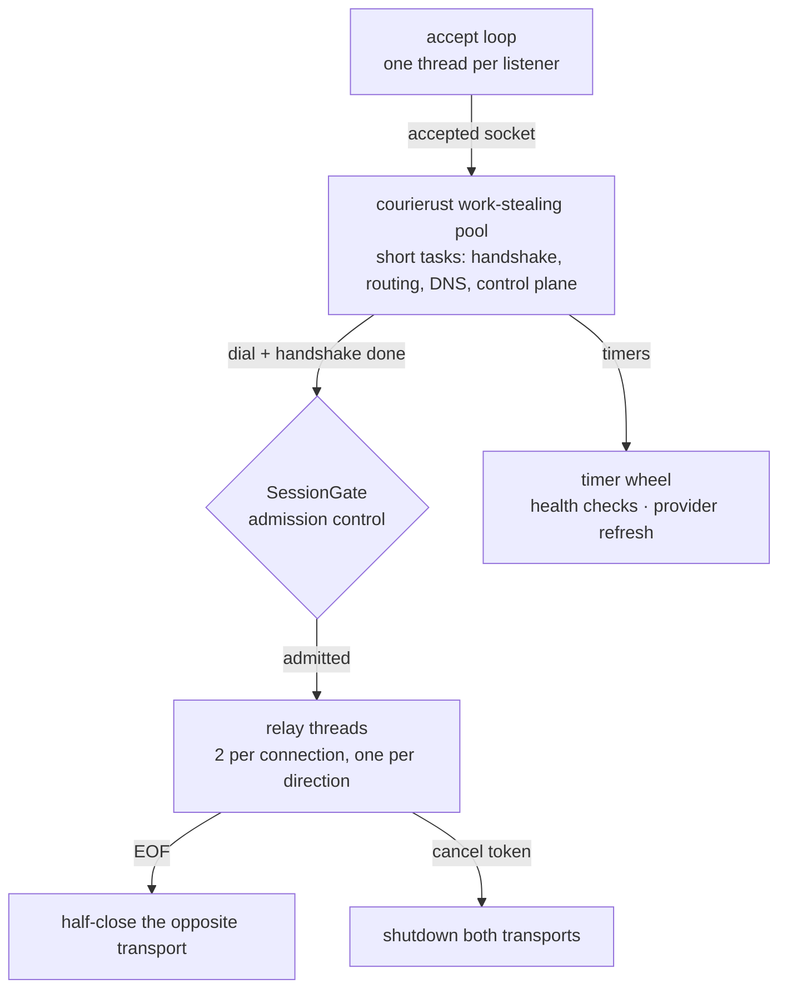

# Corduit

A synchronous, no_std-ready unified network proxy engine for Rust. One crate
carries the configuration model, the rule router, the DNS stack, a userspace
TCP/IP stack and every wire protocol it speaks — assembled from no third-party
proxy core, with **no async runtime anywhere in the dependency tree**.

[](https://crates.io/crates/corduit)
[](https://docs.rs/corduit)
[](Cargo.toml)

- **中文说明** → [README.zh-CN.md](README.zh-CN.md)
- **完整文档** → [Wiki](https://github.com/blueokanna/Corduit/wiki)（FFI / RPC / 方法参考）

---

## Legal notice — read before building or running anything

Corduit is a network engineering toolkit: proxy protocols, a rule router, DNS
and a userspace TCP/IP stack. It is published for **lawful use only**.

- **Your local law governs.** Nothing in this repository, its license or its
  documentation grants any permission the law applying to you does not already
  give you. You alone are responsible for how you use it.
- **Do not use it to break the law.** In some jurisdictions — mainland China
  included — providing or using a proxy, VPN or tunnel service to bypass state
  network controls is illegal. Corduit grants no right to do that; the
  maintainers neither authorize nor support it.
- **TUIC and Hysteria2 are opt-in.** Both are disabled Cargo features
  (`tuic`, `hysteria2`) and are absent from a default build. Enabling them is
  an explicit, deliberate decision of yours.
- **Unlawful use gets no support.** Issues, pull requests and discussions that
  would enable unlawful use will be closed.
- **No warranty, no liability.** The software is provided as is. See
  [LICENSE](LICENSE), whose additional licensor terms make lawful use a
  condition of every license granted.
- **This is not legal advice.** If you are unsure whether your intended use is
  lawful, consult a qualified lawyer in your jurisdiction before building or
  running anything.

---

## What it is

A mainstream proxy is a composite: a config loader, a rule engine, a DNS
resolver and a set of protocol kernels, each from a different upstream with its
own bug tracker and release cadence. Corduit is the opposite — one engine in
which configuration, routing, DNS, userspace networking and the wire protocols
are developed, tested and released as one unit.

Capability inventory:

- **Inbounds**: `http`, `socks5`, `mixed` (HTTP + SOCKS5 auto-detection), plus
  TUN mode over the in-tree userspace stack. `redir` / `tproxy` are recognized
  by the config model but not implemented — a build logs a warning and skips
  them instead of pretending.
- **Outbounds**: `direct`, `reject`, `socks5`, `http`, `shadowsocks`,
  `vmess`, `vless`, `trojan`, `wireguard`, and the opt-in `tuic` /
  `hysteria2`; plus the group selectors `selector`, `url-test`, `fallback`,
  `load-balance` and `relay`.
- **Routing**: `domain`, `domain-suffix`, `domain-keyword`, `domain-regex`,
  `geoip`, `ip-cidr`, `src-ip-cidr`, `src-port`, `dst-port`, `process-name`,
  `rule-set` and `match`, over the three modes `rule` / `global` / `direct`;
  rule providers and proxy providers with periodic refresh.
- **DNS**: UDP / TCP / DoH / DoT, both directions (client and server), a
  TTL-aware cache, fake-IP, hosts, bogon filtering and split resolution.
- **Synchronous by construction**: no tokio, no reactor, no `async` / `await`
  in the engine. Concurrency comes from a work-stealing pool for short tasks
  and dedicated threads for long-lived relays.
- **`no_std` core**: with `default-features = false` the crate compiles on
  `no_std + alloc` — the crypto primitives, the URL parser and the pure wire
  codecs (`protocol::address`, `protocol::error`) carry no OS dependency.
- **Hot reload** (`Corduit::reload`) and **traffic accounting**
  (per-connection up/down, speed, active list).

## Architecture



A connection enters exactly one inbound listener, is classified once by the
router, and is handed to one outbound. The relay then owns it until either side
closes; every byte it copies is accounted for per connection.

## The synchronous execution model

Corduit has no reactor. The concurrency model is layered, and every layer is
chosen for what it is measurably good at:



1. **Short tasks** — accept dispatch, handshakes, DNS lookups, control plane,
   periodic refresh — run on **courierust's work-stealing thread pool**
   (per-worker LIFO caches, a global FIFO, cross-worker stealing, zero CPU when
   idle).
2. **Long-lived relays** run on **dedicated threads**, two per connection, one
   per direction, with proper half-close semantics. Their number is bounded by
   a `SessionGate`, so relays can never starve the pool of handshake capacity.
3. **Accept loops** run one thread per listener and hand each accepted socket
   to the pool.

Blocking is bounded by socket timeouts (`SO_RCVTIMEO` / `SO_SNDTIMEO`).
`WouldBlock` / `TimedOut` mean *nothing happened yet*, and each loop re-checks a
`CancellationToken` between operations. The relay's two threads share a stream
behind a mutex, so a read that could block indefinitely would be a
lock-ordering deadlock; the relay therefore arms a 25 ms read poll
(`RELAY_READ_POLL`) before starting, which makes every lock hold bounded by
construction.

The cost of this model is stated plainly: a proxy whose workload is mostly
idle, long-lived connections occupies one thread per connection. The session
gate caps that cost and the pool keeps the short-task path fast. For a
desktop / mobile proxy engine — tens to low hundreds of concurrent
connections — that is the correct trade.

## Cargo features

| Feature | Default | What it adds |
|---|---|---|
| `std` | on | Threaded engine layer: engine, DNS servers, netstack, RPC, FFI. Implies `tls`. |
| `tls` | on | `protocol::tls` client/server layers and the TLS-based outbounds (HTTPS, Trojan, VMess/VLESS TLS, TLS inbounds). |
| `wireguard` | on | `protocol::wireguard` plus the WireGuard outbound. |
| `quic` | off | `protocol::quic` — the in-tree QUIC v1 client transport (RFC 9000/9001/9002). |
| `tuic` | off | TUIC v5 outbound. Implies `quic`. |
| `hysteria2` | off | Hysteria2 outbound (HTTP/3 `POST /auth`, Salamander obfuscation). Implies `quic`. |
| `tls13` | off | The in-tree TLS 1.3 client and the browser-shaped `ClientHello` fingerprints it can present (`chrome`, `randomized`, `off`). |
| `reality` | off | REALITY client authentication for VLESS/Trojan/VMess (`security: reality`). Implies `tls13`. |

A build without `tuic` / `hysteria2` **rejects** such an outbound with an
explicit config error naming the missing feature; it never degrades to a direct
connection. The same fail-closed rule applies to `security: reality` and to
`fingerprint` without their features.

## Division of labour: courierust vs. in-tree

[courierust](https://crates.io/crates/courierust) is a zero-dependency,
`no_std`-capable protocol suite. Corduit consumes it as a library and builds
only the layers courierust deliberately does not expose:

| Concern | Implementation |
|---|---|
| HTTP/1.1 codec, HTTP/2 connection, HTTP/3 framing | `courierust_h1` / `courierust_h2` / `courierust_h3` |
| QPACK field sections (HTTP/3 headers) | `courierust_h3::qpack` |
| HTTP client (pools, redirects, TLS settings) | `courierust_client` |
| TLS 1.2 / 1.3, X.509 validation, crypto primitives | `courierust_tls` |
| WebSocket RFC 6455 (framing, masking, fragmentation, close) | `courierust_ws`, wrapped once by `protocol::ws` |
| QUIC wire codecs (packets, frames, varint, packet protection) | `courierust_quic` |
| Work-stealing scheduler | `courierust_pool` |
| base64 | `courierust_crypto::base64` |
| QUIC v1 **connection runtime** (handshake driver, ACK/loss recovery, congestion control, flow control, datagrams) | `protocol::quic` (in-tree) |
| TLS 1.3 client with data-driven `ClientHello` fingerprints | `protocol::tls13` (in-tree) |
| REALITY client (`security: reality`) | `protocol::reality` (in-tree) |
| Shadowsocks / VMess / VLESS / Trojan / TUIC / Hysteria2 / WireGuard | `engine::outbound` (in-tree) |
| DNS wire codec, resolver, cache, fake-IP | `dns` (in-tree) |
| Userspace TCP/IP stack (SolidTCP) + NAT + TUN | `netstack` (in-tree) |

The rule applied throughout the workspace is one implementation per
responsibility: a second RFC 6455 state machine, a second QPACK codec or a
second base64 would be a defect, not a feature.

## REALITY and TLS fingerprints

The optional `tls13` / `reality` features add a second TLS engine next to
courierust's connector — one whose `ClientHello` is data-driven and whose
server authentication is a hook:

- **Fingerprints** (`fingerprint: chrome | randomized | off`): the cipher-suite
  list, extension set and order, groups, signature algorithms, ALPN and padding
  come from `courierust_fingerprint`'s Chrome profile (the parameter set of the
  JA4 specification), with GREASE and 512-byte padding like a browser hello.
  The emitted bytes are parsed back and compared by JA3/JA4 in tests.
- **REALITY** (`security: reality` with `public-key`, `short-id`,
  `server-name`): the session id carries `version || time || short-id` sealed
  with AES-256-GCM under the X25519-derived auth key, and the server is
  authenticated by the ephemeral-certificate proof (`HMAC-SHA512` over the
  certificate SPKI in place of a CA chain).
- **Reported, never faked**: certificate compression (RFC 8879) and ALPS are
  not advertised (the client cannot decompress or present them), `mldsa65`
  verification is rejected as unsupported, and a REALITY *fallback* (a real
  certificate arrives) is a hard error rather than a silent downgrade.
- **Client side only**: a REALITY *server* needs an Ed25519 signer for
  `CertificateVerify`, which the in-tree crypto layer does not provide. The
  session-id verification half is implemented and tested
  (`protocol::reality::wire::unseal_session_id`).

## The QUIC stack

courierust ships the RFC 9000/9001 wire codecs and the TLS 1.3 crypto, but no
QUIC connection runtime, and its `courierust_tls::quic` handshake driver is
crate-private. Corduit therefore implements the missing layer in
`protocol::quic`: one driver thread per connection owns the UDP socket, the
handshake runs the TLS 1.3 key schedule itself, and streams are synchronous
`Read` / `Write` handles over mutex-guarded buffers with condvar wakeups.

```mermaid
sequenceDiagram
    participant C as Corduit (client)
    participant S as QUIC server

    C->>S: Initial — CRYPTO[ClientHello]
    Note over C,S: Keys from the DCID (RFC 9001 §5.2);<br/>Initial/Handshake keys derived from the TLS secrets
    S->>C: Initial — CRYPTO[ServerHello] + ACK
    S->>C: Handshake — CRYPTO[EncryptedExtensions, Certificate, CertificateVerify, Finished]
    C->>C: verify chain (courierust_tls::x509) + CertificateVerify signature
    C->>S: Handshake — CRYPTO[Finished] + ACK
    Note over C,S: 1-RTT: application keys installed,<br/>three packet-number spaces, PTO loss recovery, NewReno, flow control
    C->>S: 1-RTT — STREAM / DATAGRAM (RFC 9221)
    S->>C: 1-RTT — STREAM / DATAGRAM
```

On top of that transport sit TUIC v5 (`tuic`) and Hysteria2 (`hysteria2`).
Hysteria2 is implemented against the official specification — HTTP/3
`POST /auth` on a client-initiated bidirectional stream (QPACK field section,
`:status 233` expected), `0x401` TCP request frames, its own UDP session /
fragment framing, and Salamander packet obfuscation (BLAKE2b-256 keyed by an
8-byte per-packet salt, applied at the socket layer).

Deliberately not offered, each called out with an explicit warning when a
config asks for it rather than silently faked: 0-RTT (early data), BBR /
TCP-Brutal congestion control (NewReno only), source-port hopping, and TLS
fingerprint mimicry on the courierust connector.

## Driving the engine

Every frontend ends up in the same typed dispatch table (`rpc::dispatch`):

| Frontend | Transport | Reference |
|---|---|---|
| Flutter / Kotlin / Swift / C++ | hand-written C ABI (`corduit_call`, `corduit_call_binary`) | [FFI-API](https://github.com/blueokanna/Corduit/wiki/FFI-API) |
| Browser dashboard / any language | localhost HTTP + WebSocket JSON-RPC | [RPC-API](https://github.com/blueokanna/Corduit/wiki/RPC-API) |
| Rust application | typed synchronous `api::*` | [Rust-API](https://github.com/blueokanna/Corduit/wiki/Rust-API) |

The RPC server binds loopback only, requires a bearer token compared in
constant time (a `?token=` query parameter for WebSocket, which browsers
cannot send headers on), and answers the WebSocket upgrade with the same
`courierust_ws` session the VMess transport uses — in the server role.

## Quick start

Build a `Config`, construct the engine, start it, stop it. There is no runtime
to set up.

```toml
[dependencies]
corduit = "0.1"
```

```rust,no_run
use corduit::engine::{
    Config, Corduit, GeneralConfig, InboundConfig, InboundType,
    OutboundConfig, OutboundType,
};

fn main() -> corduit::engine::Result<()> {
    let config = Config {
        general: GeneralConfig { mixed_port: Some(7890), ..Default::default() },
        inbounds: vec![InboundConfig {
            inbound_type: InboundType::Mixed,
            tag: "mixed-in".to_string(),
            listen: "127.0.0.1".to_string(),
            port: 7890,
            options: Default::default(),
        }],
        outbounds: vec![OutboundConfig {
            outbound_type: OutboundType::Direct,
            tag: "DIRECT".to_string(),
            server: None,
            port: None,
            options: Default::default(),
        }],
        ..Config::default()
    };

    let engine = Corduit::new(config)?;
    engine.start()?;
    // ... serve ...
    engine.stop()
}
```

Or drive the JSON facade — the same one the FFI and RPC layers call:

```rust,no_run
use corduit::api;

fn main() -> Result<(), Box<dyn std::error::Error>> {
    api::start_proxy_from_yaml(r#"
    {
      "general": { "mode": "rule", "mixed_port": 7890, "log_level": "info" },
      "dns": { "enable": true, "nameservers": ["https://dns.google/dns-query"] },
      "inbounds": [{ "type": "mixed", "tag": "mixed-in", "listen": "127.0.0.1", "port": 7890 }],
      "outbounds": [{ "type": "direct", "tag": "DIRECT" }],
      "rules": []
    }"#.to_string())?;

    let status = api::get_corduit_status()?;
    println!("running = {}", status.running);
    api::stop_proxy()?;
    Ok(())
}
```

Expose it to a dashboard in two lines:

```rust,no_run
use corduit::api;
api::start_rpc_server(8765, Some("my-token".into()))?; // 127.0.0.1 only
```

```bash
curl -X POST http://127.0.0.1:8765/rpc \
  -H "Authorization: Bearer my-token" \
  -H "Content-Type: application/json" \
  -d '{"method":"get_version"}'
# {"code":0,"data":"Corduit v0.1.5"}
```

## Configuration

One validated JSON model: `general` / `dns` / `inbounds` / `outbounds` /
`rules`. Every enum is a string, and an invalid value is rejected at the
boundary before the engine touches it. Field-by-field reference:
[Configuration](https://github.com/blueokanna/Corduit/wiki/Configuration).

## Project layout

```
src/
├── lib.rs          # module wiring, globals, no_std gating, platform entry points
├── api.rs          # typed synchronous API
├── ffi.rs          # hand-written C ABI
├── rpc/            # shared dispatch + localhost HTTP/WebSocket JSON-RPC
├── types.rs        # shared DTOs
├── common/         # pool overlay, sockets, relay, timers, cancellation, URL,
│                   #   courierust HTTP client/server, root certificates
├── engine/         # config, routing, inbounds, outbounds, providers, stats
├── crypto/         # crypto primitives + text codecs (no_std)
├── protocol/       # wire protocols: QUIC v1, TLS 1.3, REALITY, WebSocket, WireGuard
├── dns/            # DNS wire codec, resolver, cache, fake-IP, DoH/DoT
└── netstack/       # userspace TCP/IP (SolidTCP), TUN, NAT, VPN drivers
```

The `no_std` core is `crypto/`, `common/url`, `protocol/address` and
`protocol/error` — pure logic, no OS. The threaded networking layer (engine,
DNS servers, netstack, RPC, transports) is gated behind the `std` feature.

## Building and testing

```bash
cargo check --all-targets
cargo test                            # unit + property tests, default features
cargo test --features tuic,hysteria2  # include the optional QUIC-based outbounds
cargo test --doc
cargo clippy --all-targets --all-features -- -D warnings
cargo fmt --all -- --check
cargo check --no-default-features                 # the no_std protocol core
cargo check --no-default-features --features std  # engine layer, no optional protocols
```

CI runs the default matrix on Linux, macOS and Windows, plus an all-features
job (so the gated QUIC / TUIC / Hysteria2 code is built and tested as well) and
the `no_std` core check.

MSRV: **Rust 1.78**. No HTTP/TLS/QUIC third-party library and no async runtime:
the network layer is courierust plus the in-tree codecs above, and concurrency
is courierust's work-stealing pool plus `std::thread`.

## Security boundary

This is a local tool that controls network traffic, so the boundary is explicit:

- **FFI**: no panic ever unwinds across `extern "C"`; every argument is
  type-checked; the binary channel is bounded (`rustbinary`, 64 MiB cap).
- **RPC server**: loopback bind only, constant-time bearer-token comparison,
  16 MiB request cap, idle connections reaped, WebSocket upgrades validated
  against RFC 6455 (`Sec-WebSocket-Key` shape and accept value).
- **Outbound handshakes**: a WebSocket upgrade whose `Sec-WebSocket-Accept`
  does not match is a hard failure — never a warning; config-supplied handshake
  headers are validated (token name, no CR/LF) before a byte reaches the wire.
- **Data paths**: DNS compression pointers capped, MMDB reads bounds-checked,
  HTTP response bodies capped, `skip-cert-verify` off by default.

More: [Security](https://github.com/blueokanna/Corduit/wiki/Security).

## License

[PolyForm Strict License 1.0.0](LICENSE), plus additional licensor terms.

- **Permitted**: personal use (research, experiment, testing, personal study,
  hobby projects) and noncommercial purposes, including use by noncommercial
  organizations.
- **Not permitted**: distributing the software in any form (free or paid) and
  making changes or new works based on it.
- **Conditioned on lawful use**: no circumvention rights are granted, and use
  must stay inside the law that applies to you.

Required Notice: Copyright 2026 blueokanna (https://github.com/blueokanna/Corduit)
