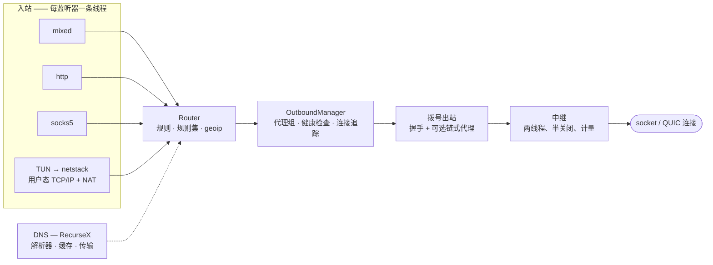
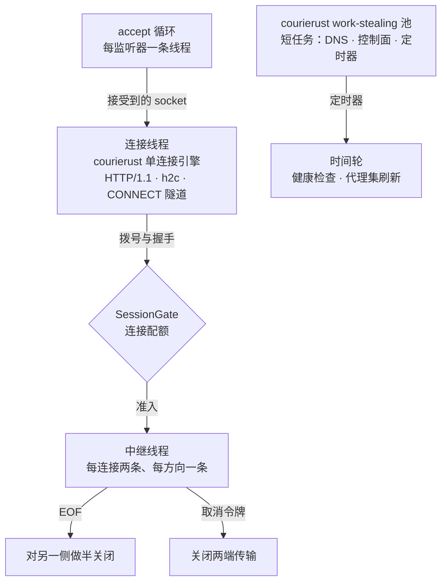
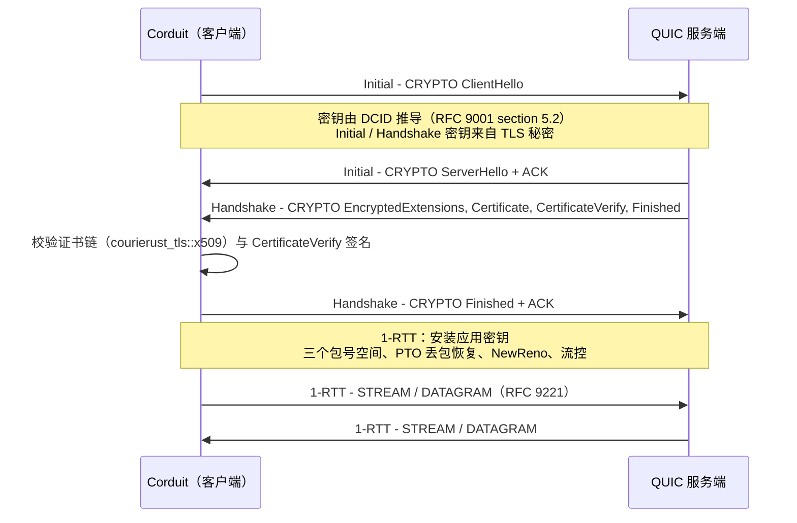

# Corduit

同步执行的 Rust 代理引擎，核心可在 `no_std` 下编译。配置模型、规则路由、DNS 栈、用户态 TCP/IP 栈与全部线路协议都在同一个 crate 里，没有拼接任何第三方代理内核，**依赖树中也没有 async runtime**。

[](https://crates.io/crates/corduit)
[](https://docs.rs/corduit)
[](Cargo.toml)

- **English** → [README.md](README.md)
- **完整文档** → [Wiki](https://github.com/blueokanna/Corduit/wiki)（FFI / RPC / 方法参考）

---

## 法律声明（构建与运行前必读）

Corduit 是网络工程工具，涵盖代理协议、规则路由、DNS 与用户态 TCP/IP 协议栈，仅面向**合法用途**发布。

- **以你所在司法辖区的法律为准。** 本仓库、其许可证与文档不授予你任何当地法律未曾给予的许可，使用后果由你自行承担。
- **不得用于违法用途。** 在某些司法辖区（包括中国大陆），提供或使用代理、VPN、隧道类服务规避国家网络管控属于违法。Corduit 不授予此类权利，维护者既不授权也不支持。
- **TUIC、Hysteria v1 与 Hysteria2 默认关闭。** 三者均为可选 Cargo feature（`tuic`、`hysteria`、`hysteria2`），默认构建不包含，是否开启由你决定。
- **违法用途不提供支持。** 涉及违法用途的 issue、PR、讨论一律关闭。
- **无担保、无责任。** 软件按“现状”提供，见 [LICENSE](LICENSE)：其中的附加许可人条款把合法使用作为所有许可的前提条件。
- **本声明不是法律意见。** 若不确定用途是否合法，请先咨询你所在辖区的执业律师，再构建或运行。

---

## 这是什么

多数代理都是拼装出来的：配置加载器、规则引擎、DNS 解析器与若干协议内核各来自不同上游，有各自的缺陷追踪与发版节奏。Corduit 把这些部分放在同一个引擎里，配置、路由、DNS、用户态网络与各线路协议一起开发、一起测试、一起发布。

能力概览：

- **入站**：`http`、`socks5`、`mixed`（HTTP + SOCKS5 自动识别）三种可配置监听器；TUN 模式基于仓库内的用户态协议栈，通过平台入口启用，而不是写进 `inbounds` 列表。`redir` / `tproxy` 能通过配置解析，但没有监听器实现：构建时打印一条警告，不会为它们启动任何东西。
- **出站**：`direct`、`reject`、`socks5`、`socks4` / `socks4a`、`http`（明文或 TLS 包裹）、`shadowsocks`、`shadowsocksr`、`snell`（v4 / v5）、`vmess`、`vless`、`trojan`、`wireguard`、`naive`（NaiveProxy），以及需要显式开启的 `shadowtls`（v3）、`tuic`（v5）、`hysteria`（v1）与 `hysteria2`；代理组 `selector`、`url-test`、`fallback`、`load-balance`、`relay`。
- **路由**：`domain`、`domain-suffix`、`domain-keyword`、`domain-regex`、`geoip`、`ip-cidr`、`src-ip-cidr`、`src-port`、`dst-port`、`process-name`、`rule-set`、`match`，配合 `rule` / `global` / `direct` 三种模式；规则集与代理集按间隔刷新。
- **DNS**：解析器是同一作者的 [RecurseX](https://crates.io/crates/recurse-x)，以依赖形式引入：上游支持 UDP / TCP / DoT / DoH / DoH3 / DoQ，带按稳定性度量的分层缓存、请求合并，以及按期望成本排序的服务器选择。Corduit 补上 profile 方言带来的那部分：`nameserver-policy`、`default-nameserver`、`hosts`、`cache-size` 的写法，加密上游的主机名到 IP 的 bootstrap，以及 bogon / GeoIP 应答过滤（RecurseX 不附带国家库）。启用 `dns.enable` 后，`dns.listen` 上会真正启动监听器，UDP 与 TCP 同时可用，并以同一份 profile 应答。
- **同步执行**：没有 tokio，没有 reactor，引擎内没有 `async` / `await`。并发来自短任务的 work-stealing 池与长连接中继的专用线程。
- **`no_std` 核心**：`default-features = false` 时以 `no_std + alloc` 编译；加密原语、URL 解析器与纯线路编解码（`protocol::address`、`protocol::error`）不依赖 OS。
- **热重载**（`Corduit::reload`）与**流量统计**（逐连接上下行、速率、活跃列表）。

## 架构



一条连接进入一个入站监听器，由路由分类一次，交给一个出站；之后由中继接管，直到任一侧关闭，期间复制的每个字节都按连接计量。

## 同步执行模型

Corduit 没有 reactor。并发是分层的，每层只做一件事：



1. **短任务**（DNS 查询、控制面、周期刷新、定时器回调）运行在 **courierust 的 work-stealing 线程池**上：每 worker 私有 LIFO、全局 FIFO、跨 worker 窃取、空闲时零 CPU。
2. **长连接中继**运行在**专用线程**上，每连接两条、每方向一条，带半关闭语义。数量由 `SessionGate` 封顶，因此中继不会挤占池中的握手容量。
3. **accept 循环**每个监听器一条线程。接入的 socket 由 **courierust 的单连接引擎**在专属线程上处理（TLS/ALPN、HTTP/1.1、HTTP/2、keep-alive、`CONNECT` 隧道、WebSocket 升级）；连接数达到监听器配额后 accept 循环被阻塞，空闲客户端无法无限扩张线程。

阻塞由 socket 超时界定（`SO_RCVTIMEO` / `SO_SNDTIMEO`）：`WouldBlock` / `TimedOut` 表示*此刻无数据*，各循环在两次操作之间检查 `CancellationToken`。中继的两个线程通过互斥量共享同一条流，一次可能无限阻塞的读会构成锁序死锁，因此中继在启动前设置 25 ms 读轮询（`RELAY_READ_POLL`），让每次持锁时长有上界。

代价是明确的：长期空闲的连接会各占一条线程。会话门限为此封顶，线程池保证短任务路径的吞吐。对几十到几百并发连接的桌面 / 移动代理来说，这个取舍是合理的。

## Cargo feature

| Feature | 默认 | 作用 |
|---|---|---|
| `std` | 开 | 线程化引擎层：engine、netstack、RPC、FFI。隐含 `tls`。 |
| `tls` | 开 | `protocol::tls` 客户端 / 服务端层，以及依赖它的出站（HTTPS、Trojan、VMess/VLESS TLS、TLS 入站）。 |
| `wireguard` | 开 | `protocol::wireguard` 与 WireGuard 出站。 |
| `quic` | 关 | `protocol::quic`，即仓库内 QUIC v1 客户端传输（RFC 9000/9001/9002）。 |
| `tuic` | 关 | TUIC v5 出站。隐含 `quic`。 |
| `hysteria` | 关 | Hysteria v1 出站（控制流认证、XPlus 混淆、struct 编码的 UDP 数据报）。隐含 `quic`。 |
| `hysteria2` | 关 | Hysteria2 出站（HTTP/3 `POST /auth`、Salamander 混淆）。隐含 `quic`。 |
| `tls13` | 关 | 仓库内 TLS 1.3 客户端，及其可呈现的浏览器形态 `ClientHello` 指纹（`chrome`、`randomized`、`off`）。 |
| `reality` | 关 | VLESS/Trojan/VMess 的 REALITY 客户端认证（`security: reality`）。隐含 `tls13`。 |
| `shadowtls` | 关 | ShadowTLS v3 出站。隐含 `tls13`。 |

未开启 `tuic`、`hysteria`、`hysteria2` 或 `shadowtls` 的构建会**直接拒绝**对应出站配置，并给出指明缺失 feature 的错误，不会退化为直连。`security: reality` 与 `fingerprint` 在缺少对应 feature 时遵循同一条 fail-closed 规则。

## 职责划分：courierust 与仓库内实现

[courierust](https://crates.io/crates/courierust) 是零依赖、`no_std` 就绪的协议套件。Corduit 以库的形式消费它，只补齐 courierust 有意不暴露的那些层：

| 关注点 | 实现位置 |
|---|---|
| HTTP/1.1 编解码、HTTP/2 连接、HTTP/3 分帧 | `courierust_h1` / `courierust_h2` / `courierust_h3` |
| QPACK 字段段（HTTP/3 头） | `courierust_h3::qpack` |
| HTTP 客户端（连接池、重定向、TLS 设置） | `courierust_client` |
| TLS 1.2 / 1.3、X.509 校验、加密原语 | `courierust_tls` |
| WebSocket RFC 6455（分帧、掩码、分片、关闭） | `courierust_ws`，由 `protocol::ws` 单点封装 |
| QUIC 线路编解码（包、帧、varint、包保护） | `courierust_quic` |
| work-stealing 调度器 | `courierust_pool` |
| base64 | `courierust_crypto::base64` |
| QUIC v1 **连接运行时**（握手驱动、ACK/丢包恢复、拥塞控制、流控、datagram） | `protocol::quic`（仓库内） |
| 数据驱动的 TLS 1.3 客户端指纹 | `protocol::tls13`（仓库内） |
| REALITY 客户端（`security: reality`） | `protocol::reality`（仓库内） |
| Shadowsocks / ShadowsocksR / Snell / VMess / VLESS / Trojan / ShadowTLS / NaiveProxy / TUIC / Hysteria / Hysteria2 / WireGuard / SOCKS4 | `engine::outbound`（仓库内） |
| DNS 解析器、语义缓存、UDP/TCP/DoT/DoH/DoH3/DoQ 传输、线格式编解码 | [RecurseX](https://crates.io/crates/recurse-x)（同作者的解析器，以依赖引入） |
| profile → 解析器 适配、上游 bootstrap、bogon/GeoIP 应答过滤 | `dns`（仓库内） |
| 用户态 TCP/IP 协议栈（SolidTCP）+ NAT + TUN | `netstack`（仓库内） |
| 双栈（IPv4 + IPv6）数据通路：v6 包解析与应答构造（TCP/UDP、v6 伪首部校验和）、v6 SOCKS5 目标与 v6 UDP 中继应答 | `netstack`（仓库内） |

仓库遵循一条准则：每个职责只保留一份实现。第二套 RFC 6455 状态机、第二份 QPACK 编解码、第二份 base64 或第二份 DNS 线格式编解码，都按缺陷处理。

## REALITY 与 TLS 指纹

可选的 `tls13` 与 `reality` feature 在 courierust 连接器之外增加第二套 TLS 引擎，它的 `ClientHello` 由数据驱动，服务端认证走可插拔钩子。

- **指纹**（`fingerprint: chrome` | `randomized` | `off`）：密码套件列表、扩展集合与顺序、groups、签名算法、ALPN 与填充来自 `courierust_fingerprint` 的 Chrome profile（JA4 规范的参数集），并按浏览器习惯加入 GREASE 与 512 字节对齐填充。测试会把发出的字节反解析成 profile，用 JA3/JA4 比对。
- **REALITY**（`security: reality` 配合 `public-key`、`short-id`、`server-name`）：session id 承载 `version || time || short-id`，以 X25519 派生认证密钥下的 AES-256-GCM 密封；服务端认证使用临时证书证明（对证书 SPKI 计算 `HMAC-SHA512`）替代 CA 链。
- **不宣告而不是伪造**：证书压缩（RFC 8879）与 ALPS 不会宣告（本客户端无法解压或呈现）；`mldsa65` 校验直接报不支持；REALITY *回落*（收到真实证书）按硬错误处理，不做静默降级。
- **仅客户端**：REALITY *服务端* 需要 Ed25519 签名能力完成 `CertificateVerify`，仓库内加密层不提供；session id 的验证方向已实现并测试（`protocol::reality::wire::unseal_session_id`）。

## QUIC 栈

courierust 提供 RFC 9000/9001 的线路编解码与 TLS 1.3 加密原语，但不提供 QUIC 连接运行时，其 `courierust_tls::quic` 握手驱动为 crate 私有。因此 Corduit 在 `protocol::quic` 中实现缺失层：每连接一条驱动线程持有 UDP socket，握手自行运行 TLS 1.3 密钥调度，流是互斥量缓冲 + 条件变量唤醒之上的同步 `Read` / `Write` 句柄。



该传输之上承载 TUIC v5（`tuic`）、Hysteria v1（`hysteria`）与 Hysteria2（`hysteria2`）：三者在 QUIC 之上没有任何共同点。Hysteria2 按官方规范实现：客户端初始化的双向流上的 HTTP/3 `POST /auth`（QPACK 字段段，期望 `:status 233`）、`0x401` TCP 请求帧、自有的 UDP 会话 / 分片组帧，以及 Salamander 包混淆（以每包 8 字节盐为密钥的 BLAKE2b-256，作用于 socket 层）。Hysteria v1 是更早的设计：控制流上的 struct（无对齐填充、大端）`client hello`、每连接一条双向流、struct 编码的 UDP 数据报，以及它自己的 XPlus 混淆（以 16 字节盐为密钥的 SHA-256）。XPlus 的用途与 Salamander 相近，但两者互不兼容，因此各自实现为独立类型。

以下四项有意不提供；配置请求时会给出显式警告，而不是静默替代：0-RTT（early data）、BBR / TCP-Brutal 拥塞控制（只有 NewReno）、源端口跳动，以及 courierust 连接器上的 TLS 指纹模拟。

## 驱动方式

无论前端是什么，最终都汇入同一张类型化分发表（`rpc::dispatch`）：

| 前端 | 传输 | 参考 |
|---|---|---|
| Flutter / Kotlin / Swift / C++ | 手写 C ABI（`corduit_call`、`corduit_call_binary`） | [FFI-API](https://github.com/blueokanna/Corduit/wiki/FFI-API) |
| 网页仪表盘 / 任意语言 | 本地 HTTP + WebSocket JSON-RPC | [RPC-API](https://github.com/blueokanna/Corduit/wiki/RPC-API) |
| Rust 应用 | 类型化同步 `api::*` | [Rust-API](https://github.com/blueokanna/Corduit/wiki/Rust-API) |

RPC 服务端只绑定回环地址，用常量时间比较校验 bearer token；WebSocket 只能通过 `?token=` 查询参数携带 token，因为浏览器无法为 WebSocket 设置请求头。升级请求由 VMess 传输所用的同一套 `courierust_ws` 会话以服务端角色应答。

## 快速开始

构造 `Config`、创建引擎、启动、停止，生命周期仅此而已，没有 runtime 需要初始化。

```toml
[dependencies]
corduit = "0.2"
```

```rust,no_run
use corduit::engine::{
    Config, Corduit, GeneralConfig, InboundConfig, InboundType,
    OutboundConfig, OutboundType,
};

fn main() -> corduit::engine::Result<()> {
    let config = Config {
        general: GeneralConfig { mixed_port: Some(7890), ..Default::default() },
        inbounds: vec![InboundConfig {
            inbound_type: InboundType::Mixed,
            tag: "mixed-in".to_string(),
            listen: "127.0.0.1".to_string(),
            port: 7890,
            options: Default::default(),
        }],
        outbounds: vec![OutboundConfig {
            outbound_type: OutboundType::Direct,
            tag: "DIRECT".to_string(),
            server: None,
            port: None,
            options: Default::default(),
        }],
        ..Config::default()
    };

    let engine = Corduit::new(config)?;
    engine.start()?;
    // ... 提供服务 ...
    engine.stop()
}
```

也可以直接使用 JSON facade，FFI 与 RPC 层调用的就是它：

```rust,no_run
use corduit::api;

fn main() -> Result<(), Box<dyn std::error::Error>> {
    api::start_proxy_from_yaml(r#"
    {
      "general": { "mode": "rule", "mixed_port": 7890, "log_level": "info" },
      "dns": { "enable": true, "nameservers": ["https://dns.google/dns-query"] },
      "inbounds": [{ "type": "mixed", "tag": "mixed-in", "listen": "127.0.0.1", "port": 7890 }],
      "outbounds": [{ "type": "direct", "tag": "DIRECT" }],
      "rules": []
    }"#.to_string())?;

    let status = api::get_corduit_status()?;
    println!("running = {}", status.running);
    api::stop_proxy()?;
    Ok(())
}
```

两行代码接入仪表盘：

```rust,no_run
use corduit::api;
api::start_rpc_server(8765, Some("my-token".into()))?; // 仅绑 127.0.0.1
```

```bash
curl -X POST http://127.0.0.1:8765/rpc \
  -H "Authorization: Bearer my-token" \
  -H "Content-Type: application/json" \
  -d '{"method":"get_version"}'
# {"code":0,"data":"Corduit v0.2.2"}
```

## 配置

单一已校验 JSON 模型：`general` / `dns` / `inbounds` / `outbounds` / `rules`。所有枚举均为字符串，非法值在边界处即被拒绝，不会流入引擎。逐字段参考：
[Configuration](https://github.com/blueokanna/Corduit/wiki/Configuration)。

## 项目结构

```
src/
├── lib.rs          # 模块接线、全局状态、no_std 门控、平台入口
├── api.rs          # 类型化同步 API
├── ffi.rs          # 手写 C ABI
├── rpc/            # 共享分发表 + 本地 HTTP/WebSocket JSON-RPC
├── types.rs        # 共享 DTO
├── common/         # 线程池封装、socket、中继、监听器、定时器、取消、URL、
│                   #   courierust HTTP 客户端、根证书
├── engine/         # 配置、路由、入站、出站、代理集、统计
├── crypto/         # 加密原语 + 文本编解码（no_std）
├── protocol/       # 线路协议：QUIC v1、TLS 1.3、REALITY、WebSocket、WireGuard
├── dns/            # profile → RecurseX 适配：上游、bogon、域名模式
└── netstack/       # 用户态 TCP/IP（SolidTCP）、TUN、NAT、VPN 驱动
```

`no_std` 核心包括 `crypto/`、`common/url`、`protocol/address` 与 `protocol/error`，都是纯逻辑、无 OS 依赖。线程化网络层（engine、DNS 服务端、netstack、RPC、各传输）由 `std` feature 门控。

## 构建与测试

```bash
cargo check --all-targets
cargo test                            # 单元 + 属性测试（默认 feature）
cargo test --features tuic,hysteria2  # 纳入可选的 QUIC 出站
cargo test --doc
cargo clippy --all-targets --all-features -- -D warnings
cargo fmt --all -- --check
cargo check --no-default-features                 # no_std 协议核心
cargo check --no-default-features --features std  # 引擎层，不含可选协议
cargo test --no-default-features --features std   # …以及该配置下的测试代码
cargo run --example minimal                       # 真跑一个引擎，只用环回端口
```

CI 在 Linux、macOS、Windows 上运行完整的检查与测试矩阵，另有 all-features 作业（覆盖被门控的 QUIC / TUIC / Hysteria 代码的构建与测试）、`no_std` 核心检查、既有检查也有测试的 `std`-only 配置、Android（aarch64 与 x86_64）与 iOS 交叉检查，以及**构建并测试** 1.78 的 MSRV 作业。桌面平台的作业还会跑只用环回端口的示例，以应用的方式驱动整个 crate，并用 `--all-features` 构建文档。`RUSTFLAGS` 与 `RUSTDOCFLAGS` 都是 `-D warnings`：出现警告或文档内链接失效，都会让构建失败。

MSRV：**Rust 1.78**。不使用任何 HTTP/TLS/QUIC 第三方库，也没有 async runtime：网络层是 courierust 加上表中列出的仓库内编解码，并发是 courierust 的 work-stealing 池加上 `std::thread`。

## 安全边界

本工具在本机控制网络流量，因此边界是显式的：

- **FFI**：没有任何 panic 能跨越 `extern "C"` 展开；全部参数经类型检查；二进制通道有界（`rustbinary`，64 MiB 上限）。
- **RPC 服务端**：仅绑回环地址，常量时间 bearer token 比较，请求体 16 MiB 上限，空闲连接回收，WebSocket 升级按 RFC 6455 校验（`Sec-WebSocket-Key` 形状与 accept 值）。
- **出站握手**：`Sec-WebSocket-Accept` 不匹配按硬失败处理，不会降级成警告；配置提供的握手头（token 名称、值中不得含 CR/LF）在写上线之前完成校验。
- **数据路径**：DNS 压缩指针有上限、MMDB 读取有边界检查、HTTP 响应体有上限、`skip-cert-verify` 默认关闭。

更多：[Security](https://github.com/blueokanna/Corduit/wiki/Security)。

## 许可

[PolyForm Strict License 1.0.0](LICENSE)，外加附加许可人条款。

- **允许**：个人用途（研究、实验、测试、个人学习、业余项目）与非商业用途，包括非商业组织使用。
- **不允许**：以任何形式分发本软件（无论免费或收费），以及基于本软件进行修改或创作衍生作品。
- **以合法使用为前提**：不授予任何规避权利，使用必须停留在适用于你的法律之内。

Required Notice: Copyright 2026 blueokanna (https://github.com/blueokanna/Corduit)
