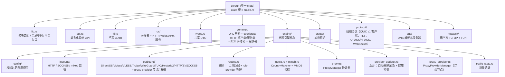
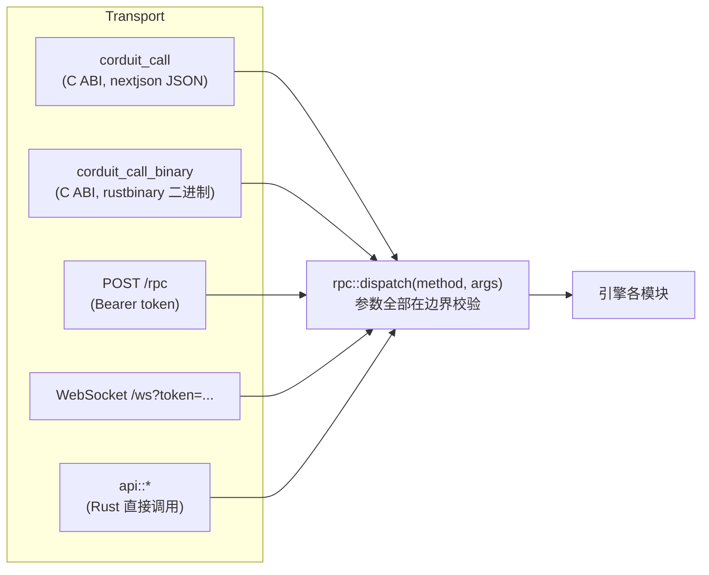
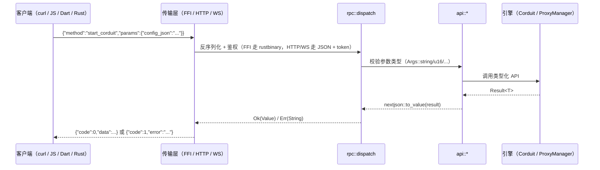
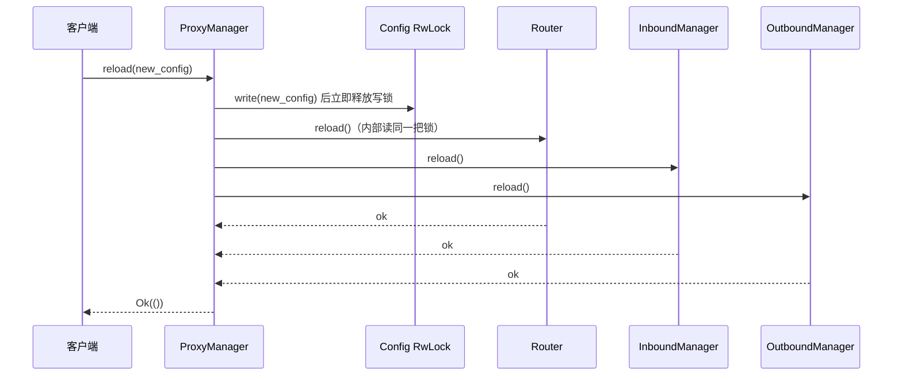
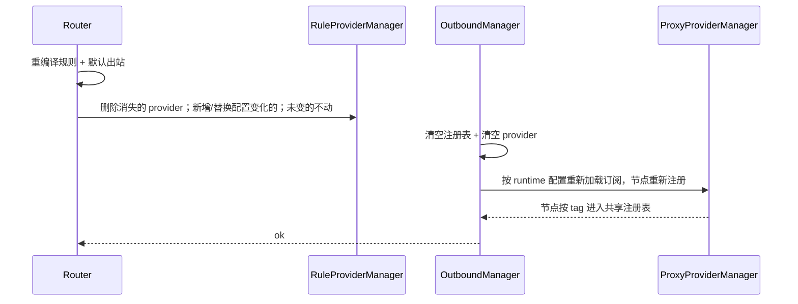
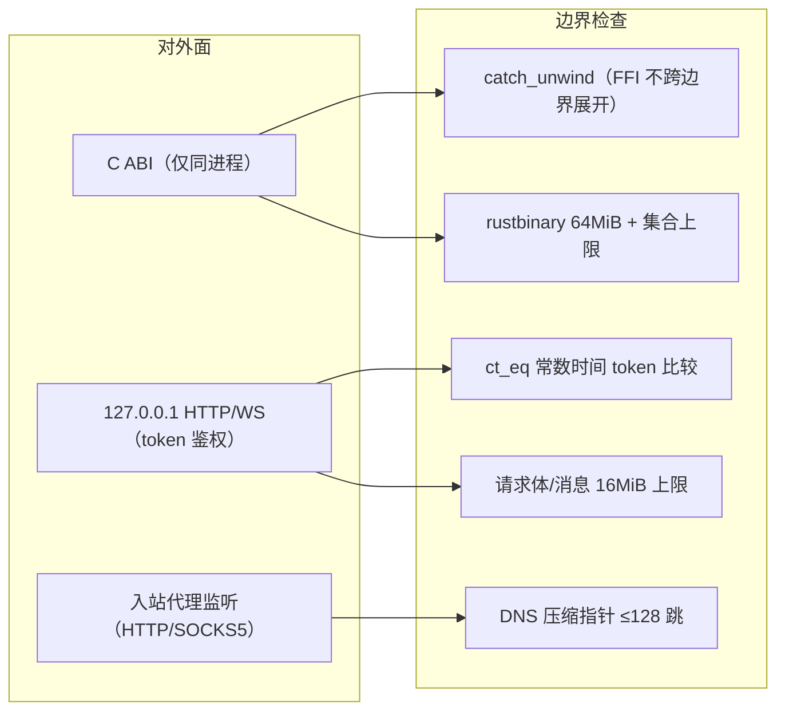

# 架构（Architecture）

Corduit 是一个单一 crate，内部按内聚模块组织，每个文件夹对应一个 `mod.rs`。

## 模块结构

## 一个分发表，三种传输

设计要点：**所有传输共享同一个分发表**，新增一个方法只需改 `rpc/mod.rs` 的 `dispatch` 一处，FFI/HTTP/WS/Rust 全部自动可用；`CORDUIT_METHODS` 常量让客户端可以动态发现支持的方法。

## 一次请求的生命周期

## 配置热重载生命周期

> 注意：`ProxyManager::reload` 先替换配置、释放写锁，再让各子管理器各自拿读锁重载。Tokio 的 `RwLock` 不可重入，持写锁等读锁会死锁——这是刻意设计。

重载时 provider 的同步（`Router::reload` + `OutboundManager::reload`）：

ProviderUpdater 在 `Corduit::start` 时启动、`stop` 时停止，默认 60 秒 tick，按各自 `interval` 刷新订阅/规则并跑健康检查（见 [Rules](Rules#6-后台-providerupdater)）。

## 安全边界

详细说明见 [Security](Security)。

## no_std 边界

引擎整体**不能** no_std——它跑在 tokio 上，依赖 `std::net`、线程、TUN 驱动和文件系统。可以独立出来做 no_std 的部分：

| 模块 | 状态 |
|---|---|
| `crypto/`（哈希/MAC/流密码/AEAD/KDF/X25519/Base64/Hex/UUID） | ✅ 已 no_std：全模块零 `std::` 引用，只用 `core` + `alloc`，无任何外部依赖 |
| `protocol/address.rs`（SOCKS 地址编解码） | ⚠️ 接近：仅 `fmt` / `io::Cursor` / `net` 三处 std，可平移 |
| `dns/wire.rs`（DNS 报文编解码） | ⚠️ 接近：`fmt` / `net` / `HashMap` 可换 `core` / `alloc` |
| `engine` / `rpc` / `api` / `ffi` / `netstack` / `common` | ❌ 依赖 tokio + std + 平台 API，无法 no_std |

也就是说：**加密与线缆编解码核心可以无 std 复用（比如做固件/嵌入式端）**，但完整代理引擎需要 std + tokio，这是设计使然，不是遗漏。
