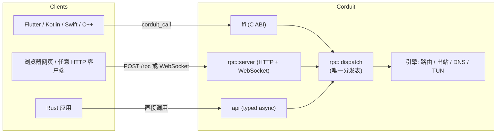

# Corduit

**Corduit** 是一个用 Rust 写的统一网络代理引擎。配置、路由、DNS、用户态网络栈和全部线缆协议都收在一个 crate 里，不拼接任何第三方代理内核。HTTP/1.1、HTTP/2、HTTP/3、TLS 1.2/1.3、WebSocket、QUIC v1 全走零依赖的 [courierust](https://crates.io/crates/courierust) 编解码栈——QUIC 客户端传输（RFC 9000/9001/9002，TLS 1.3-over-QUIC 握手、NewReno、RFC 9221 数据报）和 QPACK/HPACK 头编解码都是仓库内从零写的，TUIC v5 与 Hysteria2（官方 HTTP/3 `POST /auth` 认证）出站跑在上面——不再依赖 hyper / rustls / tokio-tungstenite / quinn。

> 本 Wiki 由 GitHub Actions 在每次 `main` 分支 CI 通过后，从仓库的 `wiki/` 目录自动同步到本页面。改文档请改仓库里的 `wiki/`。

## 它解决什么问题

传统代理（Clash、sing-box、V2Ray）把配置加载器、规则引擎、DNS、TUN 驱动和各协议内核拼在一起，每个部件来自不同上游。Corduit 反过来：**一个 crate、一份类型化配置、一个分发表、三套访问方式**。

## 三种访问方式（先看这个）

无论你的前端是什么，都走**同一个分发表**（`rpc::dispatch`），只是传输层不同：



| 前端类型 | 用什么 | 入口文档 |
|---|---|---|
| Flutter / Kotlin / Swift / C++ 原生 | C ABI：`corduit_call` / `corduit_call_binary` | [FFI-API](FFI-API) |
| 网页仪表盘 / 任意语言 | 本地 HTTP + WebSocket JSON-RPC | [RPC-API](RPC-API) |
| Rust 应用 | 类型化异步 `api::*` | [Rust-API](Rust-API) |

## 快速上手（30 秒）

```bash
# 1. 启动引擎并开启本地 RPC 服务（只绑 127.0.0.1，带 token）
cargo run --example your_binary &

# 2. 用 curl 调第一个方法
curl -X POST http://127.0.0.1:8765/rpc \
  -H "Authorization: Bearer <你的token>" \
  -H "Content-Type: application/json" \
  -d '{"method":"get_version"}'
# => {"code":0,"data":"Corduit v0.1.0"}
```

## 文档目录

| 页面 | 内容 |
|---|---|
| [Getting-Started](Getting-Started) | 从零开始：安装、起代理、三种前端都跑通 |
| [Architecture](Architecture) | 架构图（Mermaid）：模块、分发表、请求生命周期 |
| [Configuration](Configuration) | 完整配置项参考 + 示例 |
| [Rules](Rules) | 规则引擎：三种模式、规则类型语义、rule/proxy provider、clash-rules 对照 |
| [Rust-API](Rust-API) | Rust 类型化 API 完整用法 |
| [FFI-API](FFI-API) | C ABI：C / Dart 绑定示例 |
| [RPC-API](RPC-API) | HTTP / WebSocket JSON-RPC 用法 |
| [Methods-Reference](Methods-Reference) | 全部方法清单：参数、返回、示例 |
| [Security](Security) | 安全模型与边界 |
| [Troubleshooting](Troubleshooting) | 常见问题排查 |
